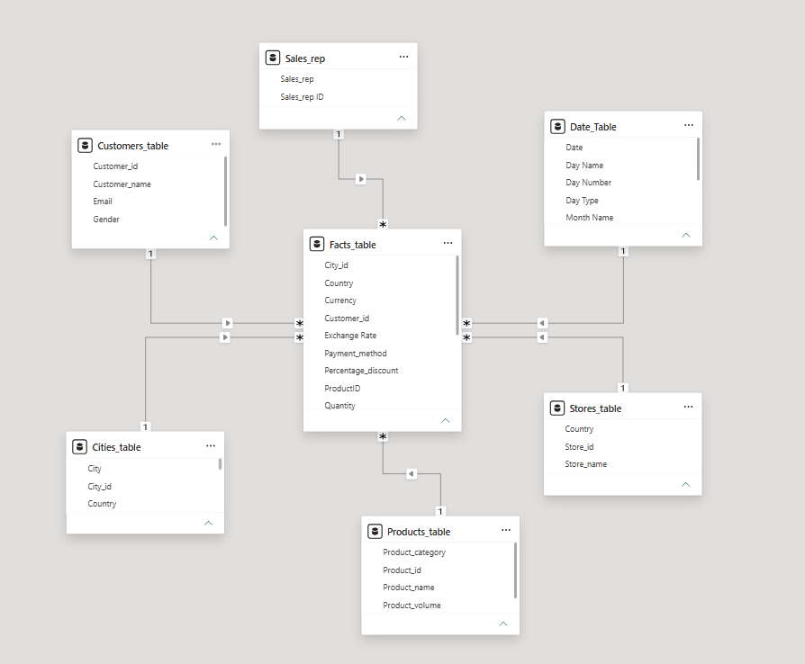
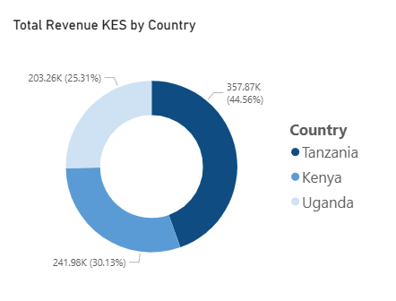
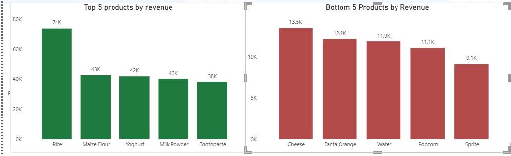
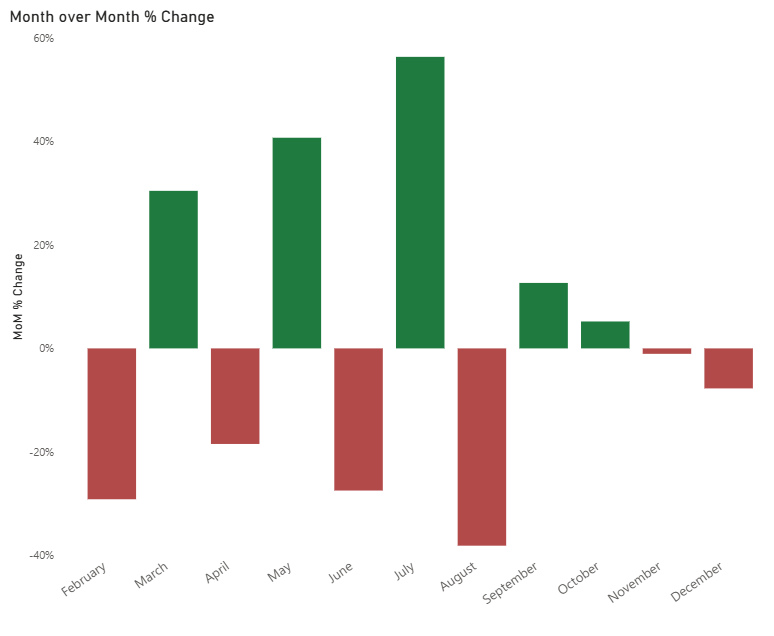
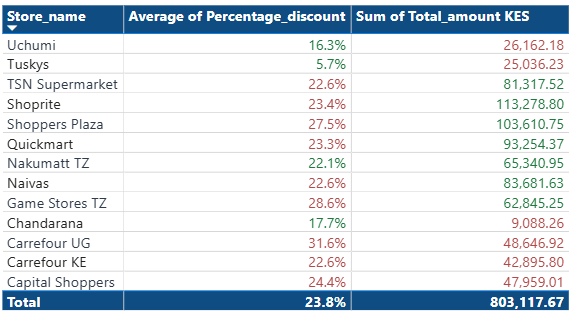

# East Africa Retail Performance Dashboard : 2024

> Data analytics project covering cleaning, modeling, DAX development, and dashboard design for an East African retail dataset.

>**Disclaimer:** This project is a portfolio exercise. The dataset was 
> synthetically generated using [Mockaroo](https://www.mockaroo.com/) and 
> does not represent the actual performance, operations, or financials of 
> any of the named stores or markets. Insights and 
> recommendations are illustrative only.

**Tools:** Microsoft Power BI · Power Query · DAX · GitHub  
**Markets:** Kenya · Tanzania · Uganda  
**Scope:** 999 transactions · 13 stores · 6 product categories · 1 Year

---

## Project Overview

This project analyses retail sales performance across three East African markets. The raw dataset was messy and required cleaning before meaningful analysis. All data transformation and visualisation was done within Power BI.

The dashboard is a single canvas divided into four sections, each answering one question:

* Revenue → How much did we make, and where did it come from? 
* Product → What are we selling and where is the value gap? 
* Seasonality → When do we peak, when do we drop, and what patterns exist? 
* Store → Which stores are driving performance and why? 

---

## Data Overview and Cleaning

The source dataset contained 1,000 records across 17 columns. Key issues found and resolved in Power Query:

| Issue | Resolution |
|-------|-----------|
| Country column had 13 variants | Standardised to 3 canonical values |
| Store names had 20+ variants | Consolidated to 13 unique store names |
| Sales rep names merged (Eg. JamesMwangi, Musaabdi) | Split and standardised to full names |
| 140 null transaction dates | Excluded from time-series analysis, only retained in totals |
| Missing city values | Excluded from city-level analysis as store-to-city mapping was unreliable |
| Missing country values | Derived from store field since each store operates in one country|
| Missing currency values | Derived from country field since each country has its own currency |
| Missing categorical values | Labelled as "Unknown" for standard representation|

**Design decision:** Missing dates were excluded from seasonality calculations. Approximately KES 108K in revenue is excluded from monthly trend analysis as a result. This is noted in the dashboard.

---
## Data Model

The cleaned dataset was modelled in Power BI using a star schema. 
A Date table was created to support time intelligence DAX measures including month-over-month change, peak month detection and seasonality strength.

> *Power BI Model View(Schema)*

**Key relationships:**
- `Date[Date]` → `Facts_table[transaction_date]` - one-to-many, active
- `Store_table[Store_ID]` → `Facts_table[Store_ID]` - one-to-many, active

## Revenue Analysis

> *Revenue by Country Donut Chart*

Total revenue: **KES 803,117** across 999 transactions.

Performance differences across markets is driven more by transaction behaviour (how often people buy and how much they spend per purchase) than store presence.

Tanzania leads at **44.6% of revenue** followed by Kenya at **30.1%** then Uganda. Tanzania's dominance is driven by both high transaction volume (456) and an equally high average order value (KES 862), indicating both strong market engagement and higher spend per transaction.

Kenya underperforms relative to its store presence, and has the lowest AOV (KES 746), indicating a weaker spend per customer. With the least revenue and transaction volume (260)Uganda has a higher AOV (KES 781) than Kenya, suggesting a smaller but higher-spending customer base.

**Decision point:** Replicating the factors driving Tanzania's strong AOV and transaction frequency could help close the gap in Kenya and Uganda.

---

## Product Analysis

> *Top 5 vs Bottom 5 Products*

Six categories, 24 products. Grains lead revenue at **KES 172K**, followed by Household (153K) and Dairy (148K).

**The Beverages problem:** Beverages rank among the highest categories by units sold but generate the least revenue at KES 83K. This is driven by significantly lower average unit prices compared to other categories, indicating a structural pricing gap; high volume, low return. 
Three of the Bottom 5 products by revenue are Beverages,(Fanta Orange, Water and Sprite) confirming the category-wide issue.
Dairy and Personal Care show the opposite: moderate volume, strong revenue, indicating better pricing per unit.

**At product level:** Rice alone generates 9.2% of total revenue, making it the single most critical product. It should be protected from stock-outs and excessive discounting. Prominent placing across stores should be ensured.

**Decision point:** The Bottom 5 products (Cheese, Fanta Orange, Water, Popcorn, Sprite) each generate under KES 12K. Keeping them as is comes with a revenue cost and therefore a decision has to be mande whether to bundle, reprice or discontinue.

---

## Seasonal Analysis

>*MoM % Change Bar Chart — Red/Green*

Monthly performance shows moderate seasonality, with peak month revenue being 1.7 times the weakest month.

**July** is the peak at KES 79,105 (+56.3% from June). **February** is the weakest at KES 46,614. The largest single-month decline is July to August at **-38.1%** . The sharp drop suggests that July's strong performance was likely driven by a temporary factor rather than a sustained increase in demand.

Month-over-month trends show recurring fluctuations rather than a sustained trajectory. Revenue stabilises in Q4 but at a level below the year's average. December closes at KES 52,963 with no festive season uplift visible.

**Decision point:** The July spike needs to be understood before it can be replicated. If revenue drivers are clear, the same approach should be applied to least performers. If the cause is unknown, that is a data gap that needs closing.

**Weekday vs weekend:** Weekdays generate 2.6× more revenue than weekends and a 6% higher average order value. Tuesday is the strongest single trading day. The weekend revenue gap represents a material untapped opportunity.

---

## Store Analysis

> *Avg Discount % by Store — Red/Green Conditional Formatting*

The top performing stores (Shoprite, Shoppers Plaza and Quickmart) together account for ~40% of total revenue, suggesting a highly concentrated revenue in 3 out of 13 stores. The bottom 3 stores (Tuskys, Uchumi, Chandarana) contribute under 7% combined.

Stores fall into four distinct performance groups:

| Group | Characteristics | Examples |
|-------|----------------|---------|
| Premium Volume | High transactions + high prices| Shoppers Plaza |
| Volume Drivers | High transactions, lower prices | Naivas|
| Premium Niche | Low volume, high price | Tuskys|
| Underperformers | Weak on both volume and price | Chandarana|

**Discounting:** Higher discounts are not driving higher revenue. Carrefour UG applies above-average discounts (~30%) yet remains a low revenue earner. Shoprite leads revenue with below-average discounting(~23%). This pattern holds across multiple stores indicating a weak relationship between discounting and performance.

**Pricing vs volume:** There is a price–volume trade-off. Naivas leads in units sold but earns less than Shoppers Plaza, which sells fewer items at higher prices. This points to pricing efficiency as a key revenue driver and not just transaction volume.

**Decision point:** Chandarana generated KES 9K (less than 2% of total revenue). Without a clear turnaround path, this store warrants formal review, whether it is to restructure, reposition, or exit. The same conversation applies to Tuskys and Uchumi.

---
## Recommendations

**1. Fix data capture at source**  

140 missing transaction dates and incomplete city fields signals weak data integrity because data gaps reduce the reliability of decision-making. Improving point-of-sale data capture will close these gaps and strengthen future analysis.

**2. Customer feedback** 

Establish customer feedback mechanisms to understand purchasing drivers. These insights ensure pricing, discounting and other marketing decisions are guided by customer behavior rather than assumptions.

**3. Understanding seasonality performance** 

Key retail periods such as holidays and back-to-school seasons do not generate the expected demand spikes, pointing to potential missed opportunities. Further investigation is needed to understand factors limiting seasonal performance.

